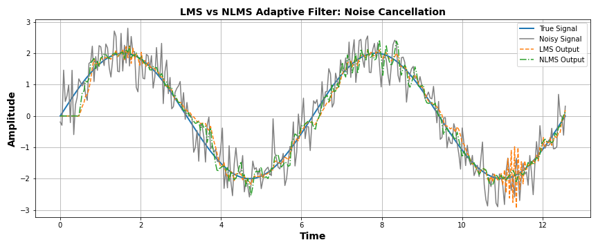
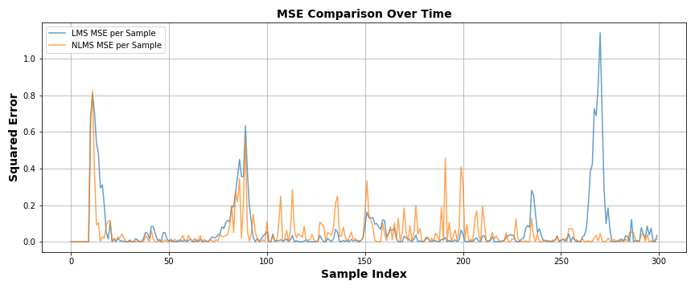
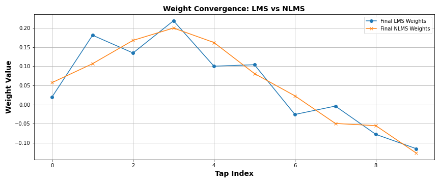

# LMS vs NLMS Adaptive Filter _ Noise Cancellation Demo

A Python educational example demonstrating how **Least Mean Squares (LMS)** and **Normalized Least Mean Squares (NLMS)** filters can be used to remove noise from a signal. This comparison helps visualize how normalization improves performance when signal power varies.

---

## Overview

* **Goal**: Denoise a sine wave corrupted by Gaussian noise
* **Approach**:

  * Implement LMS and NLMS filters
  * Compare their MSE (Mean Squared Error)
  * Visualize weight convergence and learning performance

---

## Problem Setup

* **True Signal**: $x(t) = 2 \cdot \sin(t)$
* **Noise**: Gaussian noise with mean 0, std 0.5
* **Noisy Observation**: $y(t) = x(t) + n(t)$
* **Objective**: Recover $x(t)$ from $y(t)$

---

## Algorithms

### LMS Update Rule:

```math
w[n+1] = w[n] + \mu \cdot e[n] \cdot x[n]
```

### NLMS Update Rule:

```math
w[n+1] = w[n] + \frac{\mu}{\epsilon + \|x[n]\|^2} \cdot e[n] \cdot x[n]
```

Where:

* `e[n] = d[n] - y_hat[n]`: Error between true and estimated signal
* `mu`: Learning rate
* `epsilon`: Small constant to avoid divide-by-zero

---

## Output Visualizations

### Signal Comparison



### Mean Squared Error Over Time



### Final Filter Weights



---

## Performance Metrics

| Metric      | LMS                  | NLMS                    |
| ----------- | -------------------- | ----------------------- |
| Stability   | Moderate             | High (power-normalized) |
| Convergence | Slower               | Faster                  |

---

## Files Included

* `LMS_vs_NLMS.py`: Main Python script
* `LMS_vs_NLMS_Denoising.png`: Output plot comparing signals
* `LMS_vs_NLMS_MSE.png`: Per-sample MSE
* `LMS_vs_NLMS_Weights.png`: Final weight comparison

---

## Learn More

* LMS and NLMS are popular in **adaptive filtering**, **biosignal processing**, **noise cancellation**, and **communications**.
* NLMS is especially useful when input signal power changes over time.

---

## Author

Sahar Jahani
[GitHub Profile](https://github.com/Jahani-dev)
